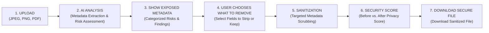

# SecureX — AI-powered Metadata Privacy Scanner

[](#review-1-scope)
[](#planned-technology-stack)
[](#review-1-workflow-pipeline)

SecureX is an intelligent, user-centric metadata privacy scanner and sanitization tool designed to protect users from unintentional information disclosure when sharing digital files.

Digital files often contain hidden, sensitive metadata—such as exact GPS coordinates, camera serial numbers, device identifiers, user accounts, and editing histories. SecureX scans these files, highlights exposed risks, allows users to choose what sensitive data to strip, and delivers a sanitized file accompanied by an actionable Privacy & Security Score.

---

## The Problem

Digital files rarely contain just visible pixels or formatted text. They carry embedded metadata specifications (EXIF, IPTC, XMP, PDF Catalog / Info dictionaries) that silently leak critical private details:

- **Geolocation Privacy Leaks**: Smartphone photos frequently embed precise latitude, longitude, and altitude, exposing home, school, or workplace locations.
- **Identity & Device Fingerprinting**: Metadata tracks hardware models, unique serial numbers, software versions, and operating system usernames.
- **Document History & Corporate Leaks**: PDFs often retain internal author names, company names, creation and modification timestamps, and file path hierarchies.
- **Lack of User Agency**: Existing sanitization tools are either "all-or-nothing" command-line utilities or opaque third-party cloud services where files must be entrusted to unknown remote servers.

---

## The Solution

**SecureX** bridges the gap between deep technical metadata inspection and consumer-grade usability:

1. **Intelligent Inspection**: Scans files to uncover embedded metadata across EXIF, XMP, and PDF dictionaries.
2. **Exposed Risk Visualization**: Categorizes metadata into human-readable privacy risk levels (Critical, High, Medium, Low) with plain-English explanations.
3. **Granular User Control**: Instead of forced complete wiping, users can selectively retain benign metadata (e.g., color space) while stripping dangerous indicators (GPS coordinates, device serials, author identities).
4. **Verified Sanitization & Security Score**: Strips selected metadata without degrading image quality or document integrity, recalculating an instant post-sanitization Privacy Security Score.
5. **Privacy-Preserving Temporary Processing**: Files are processed locally in ephemeral storage and wiped following the session lifecycle.

---

## Review 1 Workflow Pipeline

Every team member and component follows this exact sequential workflow:

$$\text{UPLOAD} \longrightarrow \text{AI ANALYSIS} \longrightarrow \text{SHOW EXPOSED METADATA} \longrightarrow \text{USER CHOOSES WHAT TO REMOVE} \longrightarrow \text{SANITIZATION} \longrightarrow \text{SECURITY SCORE} \longrightarrow \text{DOWNLOAD SECURE FILE}$$



1. **Upload**: User uploads an individual JPEG, PNG, or PDF file via the upload UI.
2. **AI Analysis**: Backend analyzes file metadata through `AnalysisService` to extract tags and assess privacy risks.
3. **Show Exposed Metadata**: Frontend displays detected metadata tags grouped by severity and category with clear explanations.
4. **User Chooses What to Remove**: User reviews detected fields and selects which tags or categories to strip.
5. **Sanitization**: Backend executes `SanitizationService` to produce a sanitized file matching the user's specific selections.
6. **Security Score**: System computes an updated Security Score showing the quantified improvement in privacy.
7. **Download Secure File**: User downloads the sanitized file with verified metadata removal and intact visible content.

---

## Review 1 Scope & Constraints

### In-Scope for Review 1
- **Target File Types**: Individual **JPEG**, **PNG**, and **PDF** files only.
- **Service Abstractions**:
  - `AnalysisService`: AI-based prototype analysis for metadata discovery and privacy risk identification.
  - `SanitizationService`: Prototype metadata sanitization engine preserving visible content.
  - `FileStorageService`: Local temporary file storage with TTL cleanup.
- **Frontend UI**: Built with **Next.js + Tailwind**, featuring upload, scanning states, metadata removal selection, score visualization, download, and error states.

### Out of Scope for Review 1 (Strict Boundaries)
- **ZIP input is NOT part of Review 1** (only single individual files are accepted; ZIP archives are rejected).
- **NO User authentication or account management**.
- **NO Cloud or object storage dependencies** (local temporary storage only).
- **NO End-to-end file encryption**.
- **NO OCR or visual text redaction**.
- **NO Face detection or visual blurring**.
- **NO Office document formats** (`.docx`, `.xlsx`, `.pptx`).

---

## Supported File Types (Review 1)

| Format | Extensions | Metadata Analyzed | Primary Risks Detected |
| :--- | :--- | :--- | :--- |
| **JPEG** | `.jpg`, `.jpeg` | EXIF, JFIF, XMP | GPS coordinates, Camera make/model, Lens serials, Capture timestamps |
| **PNG** | `.png` | tEXt, zTXt, iTXt, eXIf | Creation software, Author names, Timestamps, System comments |
| **PDF** | `.pdf` | PDF Info Dictionary, XMP Metadata | Creator tool, Producer, Author names, Creation/Modification dates |

---

## Service Abstractions

SecureX decouples application logic behind three primary service abstractions to enable Review 1 AI prototyping while allowing future transition to deterministic production engines:

```
+--------------------------------------------------------------------------------+
|                               API Layer (FastAPI)                              |
+--------------------------------------------------------------------------------+
        |                                |                               |
        v                                v                               v
+----------------------+      +----------------------+      +----------------------+
|   AnalysisService    |      | SanitizationService  |      |  FileStorageService  |
|     (Interface)      |      |     (Interface)      |      |     (Interface)      |
+----------------------+      +----------------------+      +----------------------+
        |                                |                               |
   [Review 1]                       [Review 1]                      [Review 1]
        v                                v                               v
+----------------------+      +----------------------+      +----------------------+
|   AI-Powered Model   |      |  Prototype Metadata  |      |   Local Temporary    |
|  Prototype Analyzer  |      |   Scrubbing Engine   |      |  Filesystem Storage  |
+----------------------+      +----------------------+      +----------------------+
        |                                |                               |
    [Future]                         [Future]                        [Future]
        v                                v                               v
+----------------------+      +----------------------+      +----------------------+
| Deterministic Engine |      |    Deterministic     |      | S3/GCS Cloud Storage |
| + Regex Classifier   |      | Metadata Sanitization|      | + Batch ZIP Packager |
| + Rule Risk Scoring  |      |                      |      |                      |
+----------------------+      +----------------------+      +----------------------+
```

- **`AnalysisService`**:
  - *Review 1*: AI-based prototype analysis assessing metadata sensitivity and risk levels.
  - *Future*: Deterministic metadata extraction (ExifTool / PyMuPDF / Pillow) + regex-based privacy classification + deterministic risk scoring.
- **`SanitizationService`**:
  - *Review 1*: Prototype selective metadata scrubbing preserving visible content.
  - *Future*: Deterministic byte-level metadata sanitization.
- **`FileStorageService`**:
  - *Review 1*: Local ephemeral disk storage with TTL cleanup.
  - *Future*: Cloud/object storage (S3/GCS) with optional ZIP packaging for multiple sanitized files.

---

## Future Scope (Post-Review 1)

Future versions of SecureX may expand to include:
- **Multiple File Processing & ZIP Packaging**: Support uploading multiple files and packaging sanitized outputs into a downloadable ZIP archive.
- **Deterministic Metadata Extraction**: Low-level parsers for offline, zero-latency extraction.
- **Regex-Based Privacy Classification**: Rule-based detection for emails, phone numbers, and internal IP addresses.
- **Deterministic Risk Scoring**: Formulaic scoring based on regulatory data privacy standards (GDPR, CCPA).
- **Cloud & Object Storage**: S3/GCS integration for enterprise environments.
- **Office Formats & Visual Privacy**: Support for `.docx`/`.xlsx`, OCR text redaction, and face blurring.

---

## Planned Technology Stack

- **Frontend**: Next.js + Tailwind CSS
- **Backend**: Python 3.11+, FastAPI, Pydantic v2
- **Testing**: Pytest (backend services, sanitization accuracy)
- **API Specification**: REST conventions documented in `docs/API_CONTRACT.md`

---

## Repository Structure

```text
SecureX/
├── .gitignore               # Multi-stack ignore rules (Next.js, FastAPI, temp files, secrets)
├── README.md                # Project overview, scope, and technical roadmap
├── docs/                    # Architectural and development documentation
│   ├── ARCHITECTURE.md      # Review 1 and Future system architecture
│   ├── API_CONTRACT.md      # Formal REST API specifications
│   ├── PROJECT_PLAN.md      # Detailed development plan and milestones
│   └── TEAM_WORKFLOW.md     # 4-member team responsibilities and workflow
├── frontend/                # Next.js + Tailwind web application
│   └── .gitkeep
├── backend/                 # FastAPI application and service abstractions
│   └── .gitkeep
└── tests/                   # Automated unit and sanitization tests
    └── .gitkeep
```

---

## Documentation Navigation

- [Detailed Project Plan](docs/PROJECT_PLAN.md)
- [System Architecture](docs/ARCHITECTURE.md)
- [API Contract & Schema](docs/API_CONTRACT.md)
- [Team Roles & Workflow](docs/TEAM_WORKFLOW.md)
