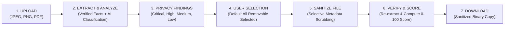

# SecureX — AI-Powered Metadata Privacy Scanner & Sanitization Engine

[](#review-1-scope)
[](#technology-stack)
[](#testing)
[](#workflow-pipeline)

SecureX is an intelligent, user-centric metadata privacy scanner and selective sanitization tool designed to protect users from accidental information exposure when sharing digital documents and images.

Digital files contain extensive embedded metadata—such as exact GPS coordinates, camera hardware serials, device fingerprints, author identities, and software version histories. SecureX extracts verified metadata facts locally, classifies exposure risks via rule-based AI intelligence, lets users choose what to strip, performs selective sanitization, verifies removal, and computes an actionable before-and-after Security Score.

---

## Review 1 Workflow Pipeline

The entire system operates according to this verified sequential lifecycle:

$$\text{UPLOAD} \longrightarrow \text{ANALYZE METADATA} \longrightarrow \text{SHOW PRIVACY FINDINGS} \longrightarrow \text{SELECT WHAT TO REMOVE} \longrightarrow \text{SANITIZE} \longrightarrow \text{VERIFY REMOVAL} \longrightarrow \text{SECURITY SCORE} \longrightarrow \text{DOWNLOAD SECURE FILE}$$



1. **Upload**: User uploads an individual JPEG, PNG, or PDF file (up to 25 MB).
2. **Analyze Metadata**: Pillow & pypdf parse binary structures to extract factual metadata tags locally. Pluggable AI provider classifies risk severity.
3. **Show Privacy Findings**: Frontend renders classified risks with severity badges, category tags, exposed values, and clear explanations.
4. **User Selects What to Remove**: User checks or unchecks fields to remove (all removable findings are selected by default).
5. **Sanitize File**: Backend performs surgical metadata removal while preserving visual pixels and layout dimensions 100% unaltered.
6. **Verify & Score**: Metadata is re-extracted from the sanitized binary. A deterministic weighted-risk algorithm calculates the final 0–100 security score and before/after improvement.
7. **Download Secure File**: User downloads the sanitized file binary with confirmed metadata elimination.

---

## Review 1 Supported File Types

| Format | Extensions | Extracted Metadata Specifications | Primary Risks Identified |
| :--- | :--- | :--- | :--- |
| **JPEG** | `.jpg`, `.jpeg` | EXIF, GPS IFD, Sub-IFD, Camera tags | Exact GPS coordinates, camera make/model, author, creation timestamp |
| **PNG** | `.png` | tEXt, zTXt, iTXt chunks, EXIF | Author name, editing software, creation dates, copyright comments |
| **PDF** | `.pdf` | PDF Info Dictionary, Document Catalog | Author, creator software, producer tool, document title, subject |

> **Note on Input**: Review 1 accepts single files only. ZIP archives and batch uploads are explicitly rejected.

---

## Technology Stack

- **Frontend**:
  - Next.js (App Router, React 19, TypeScript)
  - Tailwind CSS
  - Custom Webpack build (`--webpack`) for Windows Application Control compatibility
- **Backend**:
  - Python 3.10+, FastAPI, Uvicorn, Pydantic v2
  - Pillow (selective image EXIF/GPS/PNG text chunk scrubbing)
  - pypdf (selective document dictionary scrubbing)
- **AI Privacy Intelligence**:
  - Pluggable provider interface (`app/services/ai/base.py`)
  - **Mock AI Provider**: Active by default for Review 1. Evaluates factual metadata deterministically without requiring an external AI API key or network call. Seamlessly swappable with Anthropic Claude or OpenAI in future reviews.

---

## Architecture Overview

```text
frontend/ (Next.js on localhost:3000)
   │
   │ REST HTTP / JSON
   ▼
backend/app/main.py (FastAPI on localhost:8000)
   ├── api/routes/
   │    ├── upload.py        --> POST /api/v1/upload
   │    ├── analysis.py      --> POST /api/v1/analyze/{file_id}
   │    ├── scoring.py       --> POST /api/v1/score/{file_id}, GET /api/v1/result/{sanitized_file_id}
   │    ├── sanitization.py  --> POST /api/v1/sanitize/{file_id}, GET /api/v1/download/{sanitized_file_id}
   │    └── health.py        --> GET /health
   │
   └── services/
        ├── storage_service.py        (LocalStorageService: safe UUID file isolation & TTL)
        ├── metadata_extractor.py     (UnifiedMetadataExtractor: Pillow & pypdf factual parsers)
        ├── ai/mock_provider.py       (MockAIAnalysisProvider: offline deterministic classification)
        ├── sanitization_service.py   (DefaultSanitizationService: surgical metadata stripping & verification)
        └── security_score_service.py (SecurityScoreService: deterministic 0-100 weighted risk scoring)
```

---

## Security Score & Risk Model

The security score is calculated strictly from metadata that **remains** in the file after sanitization:

$$\text{risk\_points} = \sum (\text{CRITICAL: 30} + \text{HIGH: 20} + \text{MEDIUM: 10} + \text{LOW: 5})$$
$$\text{security\_score} = \max(0, 100 - \text{risk\_points})$$
$$\text{improvement} = \max(0, \text{after\_score} - \text{before\_score})$$

| Score | Risk Level | Deterministic Guidance |
| :--- | :--- | :--- |
| **90–100** | `SAFE` | "Your file contains minimal/no detected privacy-sensitive metadata and is generally safe to share." |
| **70–89** | `LOW RISK` | "Your file has some remaining privacy metadata. Review the remaining findings before sharing." |
| **40–69** | `MEDIUM RISK` | "Your file still contains privacy-sensitive metadata. Consider removing additional information before sharing." |
| **0–39** | `HIGH RISK` | "Your file contains significant privacy-sensitive metadata. Remove high-risk metadata before sharing." |

---

## API Overview

| Method | Endpoint | Description |
| :--- | :--- | :--- |
| `GET` | `/health` | Service health check |
| `POST` | `/api/v1/upload` | Upload single JPEG, PNG, or PDF (multipart/form-data) |
| `POST` | `/api/v1/analyze/{file_id}` | Extract metadata facts and classify privacy exposure risks |
| `POST` | `/api/v1/score/{file_id}` | Calculate deterministic 0–100 security score |
| `POST` | `/api/v1/sanitize/{file_id}` | Selectively strip chosen metadata fields and verify removal |
| `GET` | `/api/v1/result/{sanitized_file_id}` | Get complete final privacy result with score comparison |
| `GET` | `/api/v1/download/{sanitized_file_id}` | Download sanitized binary file with Content-Disposition |

---

## How to Run the Project

### Prerequisites
- Node.js v20+ & npm v10+
- Python 3.10+

### 1. Start Backend

```powershell
cd F:\SecureX\backend
.\.venv\Scripts\uvicorn app.main:app --host 127.0.0.1 --port 8000 --reload
```

The backend API will be available at `http://127.0.0.1:8000`. Interactive docs are at `http://127.0.0.1:8000/docs`.

### 2. Start Frontend

```powershell
cd F:\SecureX\frontend
npm run dev
```

The frontend web app will be available at `http://localhost:3000`.

### Environment Variables

Frontend `.env.local` configuration:
```env
NEXT_PUBLIC_API_BASE_URL=http://127.0.0.1:8000
```

> **No API Key Required**: The default AI provider is fully deterministic and operates locally. No OpenAI or Anthropic API key is needed for Review 1.

---

## Testing & Validation

### Run Backend Test Suite (81 Tests)
```powershell
cd F:\SecureX\backend
.\.venv\Scripts\pytest -v
```

### Run Frontend Verification
```powershell
cd F:\SecureX\frontend
npm run lint
npm run build
```

---

## Review 1 Boundaries & Current Limitations

- **Single File Only**: Batch uploads and ZIP archives are not supported.
- **Supported Formats**: JPEG, PNG, and PDF only. Office files (`.docx`, `.xlsx`, `.pptx`) are out of scope.
- **Local Ephemeral Storage**: Files are retained temporarily in local storage with automatic eviction; no cloud storage dependencies.
- **No User Accounts**: Authentication and session databases are omitted for Review 1.
- **Visual Redaction**: OCR text redaction and face detection are planned for post-Review 1.

---

## Repository Structure

```text
SecureX/
├── .gitignore               # Multi-stack ignore rules
├── README.md                # Project documentation
├── docs/                    # Architectural and contract documentation
│   ├── ARCHITECTURE.md      # Review 1 and future architecture
│   ├── API_CONTRACT.md      # REST API specifications
│   ├── PROJECT_PLAN.md      # Milestone timeline
│   └── TEAM_WORKFLOW.md     # Team roles and responsibilities
├── frontend/                # Next.js 16 Web Application
│   ├── src/
│   │   ├── app/             # App router pages, layouts, globals.css
│   │   ├── components/      # Reusable UI components
│   │   ├── lib/api.ts       # Centralized API client
│   │   └── types/api.ts     # TypeScript API contracts
│   └── package.json
└── backend/                 # FastAPI REST Engine
    ├── app/                 # Routes, services, models, core
    ├── tests/               # 81 automated tests
    └── requirements.txt
```
