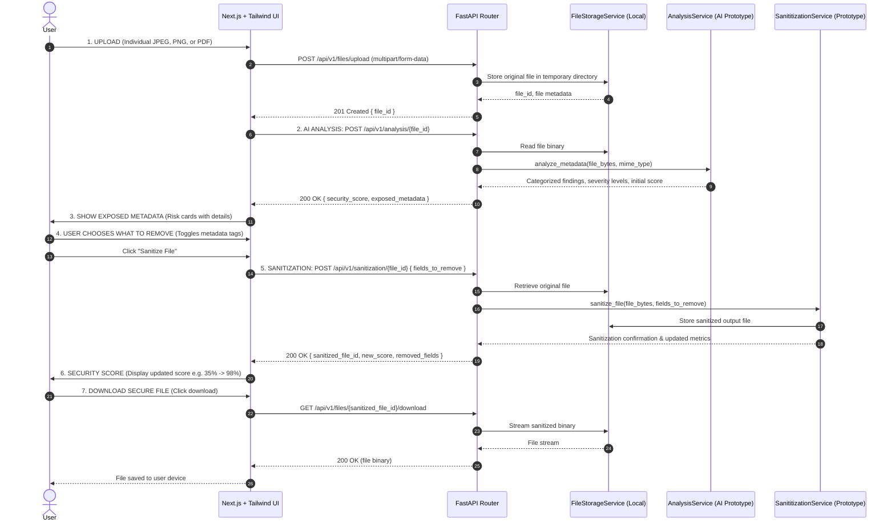
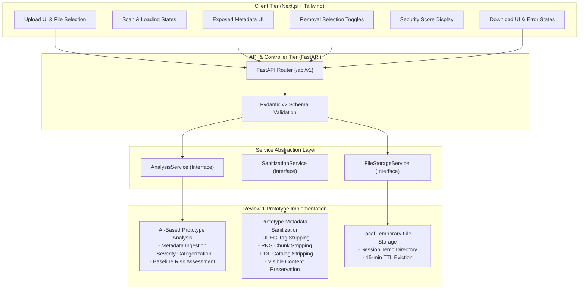
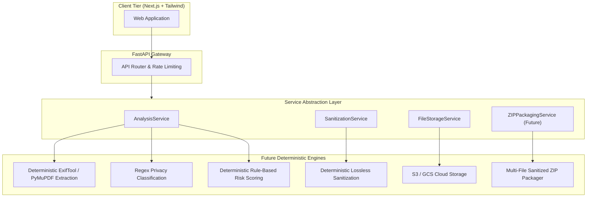

# SecureX — System Architecture Document

## 1. Executive Summary

SecureX is built upon a **service-oriented architecture** that decouples the frontend client, API router, and core file processing services.

For **Review 1**, the application operates as an intelligent privacy prototype leveraging:
- A modern **Next.js + Tailwind** frontend.
- A **FastAPI** backend with strict Pydantic v2 schemas.
- Clean service abstractions: `AnalysisService`, `SanitizationService`, and `FileStorageService`.
- Review 1 input restricted to individual **JPEG**, **PNG**, and **PDF** files (ZIP input is strictly excluded).

The architecture ensures that the Review 1 AI prototype can later be replaced by deterministic production engines without requiring frontend modifications or API contract breakage.

---

## 2. Review 1 Workflow

Every component in the system adheres to the identical 7-stage sequential pipeline:

$$\text{UPLOAD} \longrightarrow \text{AI ANALYSIS} \longrightarrow \text{SHOW EXPOSED METADATA} \longrightarrow \text{USER CHOOSES WHAT TO REMOVE} \longrightarrow \text{SANITIZATION} \longrightarrow \text{SECURITY SCORE} \longrightarrow \text{DOWNLOAD SECURE FILE}$$

---

## 3. Review 1 Component Architecture

---

## 4. Service Abstraction Contracts

The backend enforces decoupling through three explicit abstract interfaces:

### 4.1 `AnalysisService`
- **Role**: Ingests raw file bytes (JPEG, PNG, or PDF) and returns structured privacy findings.
- **Review 1 Implementation**: AI-based prototype analysis. Inspects raw metadata fields, assigns severity levels (Critical, High, Medium, Low), generates user-friendly explanations, and computes the initial Privacy Security Score (0–100).
- **Future Implementation**: Deterministic metadata extraction (ExifTool / PyMuPDF / Pillow), regex-based privacy pattern classification, and deterministic risk-scoring rules.

### 4.2 `SanitizationService`
- **Role**: Receives the original file and a list of user-selected metadata concerns, producing a verified sanitized binary.
- **Review 1 Implementation**: Prototype metadata sanitization engine. Strips selected metadata fields while strictly preserving visible file content (zero image re-compression degradation and fully intact PDF rendering).
- **Future Implementation**: Production-hardened deterministic byte-level sanitization engines.

### 4.3 `FileStorageService`
- **Role**: Manages the persistence, retrieval, and lifecycle of original and sanitized files.
- **Review 1 Implementation**: Ephemeral local disk storage with UUID isolation and automated 15-minute TTL eviction.
- **Future Implementation**: Cloud object storage (S3/GCS) with presigned URLs and optional ZIP packaging for multiple sanitized files.

---

## 5. Architectural Evolution: Review 1 vs. Future

| Dimension | Review 1 Prototype | Future Production Architecture |
| :--- | :--- | :--- |
| **Analysis Engine** | AI-based prototype analysis behind `AnalysisService` | Deterministic extraction + Regex privacy classification + Rule-based risk scoring |
| **Sanitization Engine** | Prototype selective metadata stripper behind `SanitizationService` | Deterministic lossless metadata sanitization |
| **File Storage** | Ephemeral local disk storage behind `FileStorageService` | Cloud/object storage (S3/GCS) with presigned URLs |
| **Input Files** | Individual JPEG, PNG, and PDF files only (**No ZIP input**) | JPEG, PNG, PDF, plus optional multi-file batch processing |
| **Output Delivery** | Single sanitized file download | Single download or optional multi-file ZIP archive bundle |
| **Frontend UI** | Next.js + Tailwind with unified single-file flow | Next.js + Tailwind with multi-file queue and batch actions |
| **Scope Boundaries** | Single file, no auth, no OCR, no encryption, no Office formats | Multi-file ZIP export, OCR redaction, face blurring, Office documents |

---

## 6. Future Architecture Blueprint

---

## 7. Privacy & Security Principles

1. **Zero Data Retention**: Temporary uploaded and sanitized files are deleted upon session completion or after a 15-minute TTL.
2. **Strict Single-File Validation**: Input validation strictly accepts only individual JPEG, PNG, and PDF payloads, rejecting ZIP archives and unsupported MIME types.
3. **Lossless Quality Guarantee**: The sanitization pipeline strips only metadata bytes, guaranteeing that visible raster pixels and PDF visual layouts remain completely unaltered.
4. **No Client-Side Privacy Logic**: All metadata analysis and stripping happens strictly on the backend behind service abstractions, ensuring consistency and preventing tampering.
