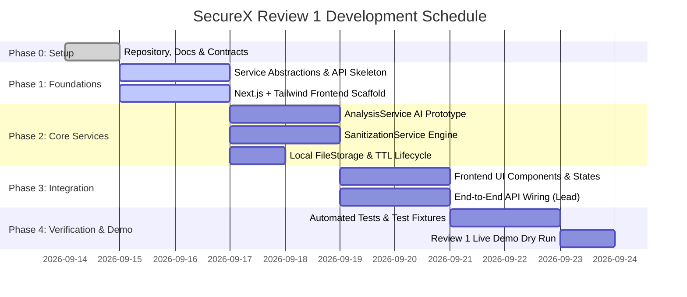

# SecureX — Detailed Project Plan

## 1. Project Overview & Objective

**SecureX** is an AI-powered metadata privacy scanner and selective sanitization platform. The objective for **Review 1** is to deliver an end-to-end working prototype that processes individual **JPEG, PNG, and PDF** files through a unified privacy pipeline:

$$\text{UPLOAD} \longrightarrow \text{AI ANALYSIS} \longrightarrow \text{SHOW EXPOSED METADATA} \longrightarrow \text{USER CHOOSES WHAT TO REMOVE} \longrightarrow \text{SANITIZATION} \longrightarrow \text{SECURITY SCORE} \longrightarrow \text{DOWNLOAD SECURE FILE}$$

The platform empowers users to identify hidden privacy risks, choose exactly what metadata to strip, verify the sanitization, review their improved Security Score, and download the protected file.

---

## 2. Review 1 Scope & Boundary Constraints

- **Accepted Files**: Individual **JPEG**, **PNG**, and **PDF** files only.
- **Strict Input Constraint**: **ZIP input is NOT part of Review 1.** Future versions may support multi-file processing and package sanitized files into a ZIP download, but Review 1 accepts only single files.
- **Service Abstractions**: Core capabilities reside behind three interfaces:
  - `AnalysisService`: Review 1 AI prototype $\rightarrow$ Future deterministic extraction + regex classification + rule scoring.
  - `SanitizationService`: Review 1 prototype scrubbing $\rightarrow$ Future deterministic lossless sanitization.
  - `FileStorageService`: Review 1 local temporary storage $\rightarrow$ Future cloud storage.
- **No Unnecessary Technologies / Feature Creep**: No user authentication, no database/cloud dependencies, no OCR/face blurring, no encryption, and no Office document formats (`.docx`/`.xlsx`).

---

## 3. Technology Stack Alignment

- **Frontend**: Next.js + Tailwind CSS
- **Backend**: Python 3.11+, FastAPI, Pydantic v2
- **Testing**: Pytest (backend services & sanitization verification)
- **Contracts**: REST API specs defined in `docs/API_CONTRACT.md`

---

## 4. Phased Implementation Roadmap

### Phase 0: Project Setup & Baseline (Current)
- [x] Configure Git repository, remote tracking, and `.gitignore`.
- [x] Establish detailed documentation (`README.md`, `PROJECT_PLAN.md`, `ARCHITECTURE.md`, `API_CONTRACT.md`, `TEAM_WORKFLOW.md`).
- [x] Define basic folder structure (`frontend/`, `backend/`, `tests/`, `docs/`).

### Phase 1: Service Interfaces & Application Scaffolding
- **Backend (Member 1 & Member 4)**:
  - Initialize FastAPI skeleton and define abstract classes for `AnalysisService`, `SanitizationService`, and `FileStorageService`.
  - Implement local temporary filesystem handling with UUIDs and TTL cleanup.
- **Frontend (Member 2)**:
  - Initialize Next.js project with Tailwind CSS.
  - Establish base layout: Header, Pipeline Stepper, Upload Dropzone, Findings Inspector, Score Card, Download UI.

### Phase 2: Prototype Service Implementations
- **AI Analysis Engine (Member 3)**:
  - Build `AnalysisService` prototype analyzing JPEG, PNG, and PDF metadata.
  - Categorize findings into severity levels: Critical (GPS), High (Device serials, owner IDs), Medium (Timestamps, software versions), Low (Color profiles).
  - Generate plain-English privacy explanations and compute initial Security Score (0–100).
- **Sanitization Pipeline (Member 4)**:
  - Build `SanitizationService` prototype to strip user-selected metadata for JPEG, PNG, and PDF.
  - Ensure zero visible content loss (lossless raster preservation and readable PDF body).
  - Recalculate post-sanitization Security Score.

### Phase 3: UI Implementation & End-to-End Integration
- **Frontend Views (Member 2)**:
  - Implement Upload UI with drag-and-drop and file selection feedback.
  - Implement loading and scanning states with clear user messaging.
  - Implement Privacy Findings UI and interactive metadata removal selection toggles.
  - Implement Sanitization Progress, Security Score gauge, and Download UI with error states.
  - Ensure no AI/privacy processing logic lives in the frontend.
- **Integration (Member 1)**:
  - Connect Next.js frontend to FastAPI backend endpoints adhering to `docs/API_CONTRACT.md`.
  - Validate end-to-end flow from upload to download.

### Phase 4: Testing & Demo Rehearsal
- **Testing (Member 4 & Member 1)**:
  - Create test fixtures (`sample_gps.jpg`, `sample_screenshot.png`, `sample_doc.pdf`).
  - Run Pytest suites verifying metadata is completely stripped and visible content preserved.
  - Test validation error states (rejecting invalid types like ZIP, files exceeding size limits).
- **Demo Preparation (All Members, led by Member 1)**:
  - Rehearse live demonstration showcasing the full 7-step workflow on a photo with GPS.

---

## 5. Responsibility Assignment Matrix (RACI)

| Milestone / Deliverable | Member 1 (Lead / Integration) | Member 2 (Frontend) | Member 3 (AI Analysis) | Member 4 (Sanitization / QA) |
| :--- | :---: | :---: | :---: | :---: |
| Overall Architecture & Repo Setup | **A / R** | C | C | C |
| API Contract Ownership | **A / R** | C | C | C |
| Next.js + Tailwind Setup & UI Views | C | **A / R** | I | I |
| Loading, Scan, and Error States | C | **A / R** | I | I |
| `AnalysisService` AI Prototype | C | I | **A / R** | C |
| Privacy Categorization & Risk Scoring | C | I | **A / R** | C |
| `SanitizationService` Pipeline | C | I | C | **A / R** |
| Visual Content Preservation | C | I | C | **A / R** |
| Sanitization Tests & Test Fixtures | C | I | C | **A / R** |
| Frontend/Backend API Integration | **A / R** | **R** | I | I |
| End-to-End Integration Testing | **A / R** | C | C | **R** |
| Final Demo Integration & Dry Run | **A / R** | C | C | C |

*R = Responsible, A = Accountable, C = Consulted, I = Informed*

---

## 6. Definition of Done (DoD) for Review 1

A deliverable is considered complete for Review 1 only when:
1. It processes individual JPEG, PNG, and PDF files without runtime errors.
2. ZIP inputs are rejected cleanly with a descriptive error message.
3. Every step of the 7-stage workflow executes sequentially and correctly in the browser.
4. AI/privacy logic remains strictly behind `AnalysisService`.
5. Sanitization preserves 100% of visible file content while eliminating selected tags.
6. All changes adhere to `docs/API_CONTRACT.md` and pass integration testing.
