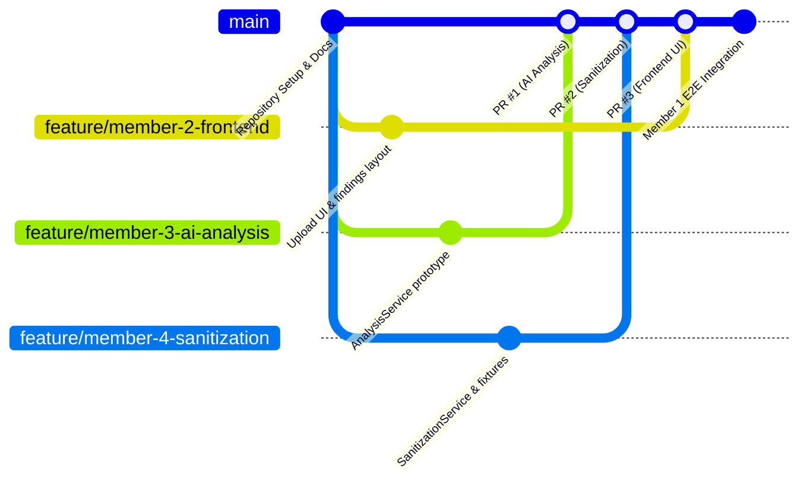

# SecureX — 4-Member Team Workflow & Engineering Standards

## 1. Shared Workflow Pipeline

Every team member must design, build, and test against the **identical Review 1 workflow**:

$$\text{UPLOAD} \longrightarrow \text{AI ANALYSIS} \longrightarrow \text{SHOW EXPOSED METADATA} \longrightarrow \text{USER CHOOSES WHAT TO REMOVE} \longrightarrow \text{SANITIZATION} \longrightarrow \text{SECURITY SCORE} \longrightarrow \text{DOWNLOAD SECURE FILE}$$

### Review 1 File Scope
- **Accepted Files**: Individual **JPEG**, **PNG**, and **PDF** files only.
- **Strict Constraint**: **ZIP input is NOT part of Review 1.** (Future versions may support multiple files and package sanitized files into a ZIP output, but Review 1 accepts only single JPEG, PNG, or PDF files).

---

## 2. Team Composition & Role Ownership

Responsibilities for the 4 hackathon team members are explicitly divided as follows:

```
+---------------------------------------------------------------------------------------+
|                            SecureX 4-Member Team Structure                            |
+---------------------------------------------------------------------------------------+
        |                                                   |
        v                                                   v
[Member 1 — Team Lead / Integration]           [Member 2 — Frontend Developer]
• Overall architecture                         • Next.js + Tailwind
• GitHub repository & branch coordination      • Upload UI & File selection
• API contract ownership                       • Loading/scan states
• Frontend/backend integration                 • Privacy findings UI
• Environment configuration                    • Metadata removal selection UI
• End-to-end integration testing               • Sanitization progress & download UI
• Final demo integration                       • Security score/result UI & error states
• Merge conflicts & shared workflow oversight  • No AI/privacy processing in frontend
        |                                                   |
        +-------------------------+-------------------------+
                                  |
        +-------------------------+-------------------------+
        |                                                   |
        v                                                   v
[Member 3 — AI Analysis / Privacy Intelligence] [Member 4 — Sanitization / File Processing]
• Review 1 AI analysis                         • Review 1 sanitization pipeline
• Analyze JPEG, PNG & PDF files                • Receive file & user-selected concerns
• Return structured findings                   • Generate actual sanitized file
• Categorize severity & generate explanations  • Preserve visible file content (JPEG, PNG, PDF)
• Produce overall risk assessment              • Return sanitized file ID & verify result
• Behind AnalysisService abstraction           • Sanitization tests & test fixtures
```

### Detailed Member Responsibilities

#### Member 1 — Team Lead / Integration
- Overall architecture oversight.
- GitHub repository and branch coordination.
- API contract ownership (`docs/API_CONTRACT.md`).
- Frontend/backend integration.
- Environment configuration (`.env` coordination, port management).
- End-to-end integration testing across the full 7-step pipeline.
- Final demo integration and presentation readiness.
- Resolve merge conflicts and ensure all members follow the shared workflow.

#### Member 2 — Frontend Developer
- User interface built with **Next.js + Tailwind**.
- Upload UI (drag-and-drop zone and file picker for individual JPEG, PNG, PDF).
- File selection and file validation feedback.
- Loading and scanning states (skeleton screens, processing spinners).
- Privacy findings UI (displaying detected metadata grouped cleanly).
- Metadata removal selection UI (interactive toggle controls for individual tags and categories).
- Sanitization progress indication.
- Security score / result UI (before-vs-after score visualization).
- Download UI (clean file delivery button with success feedback).
- Comprehensive error states (invalid file types, file too large, server errors).
- **Strict Boundary**: No AI or privacy processing logic in the frontend; all data is fetched from the backend API.

#### Member 3 — AI Analysis / Privacy Intelligence
- Review 1 AI analysis implementation.
- Analyze JPEG, PNG, and PDF files for privacy-sensitive metadata (EXIF, XMP, PDF catalogs).
- Return structured findings strictly adhering to the API schema.
- Categorize severity (Critical, High, Medium, Low).
- Generate plain-English privacy explanations for non-technical users.
- Produce overall risk assessment and baseline Security Score (0–100).
- Keep implementation encapsulated behind the `AnalysisService` abstraction.

#### Member 4 — Sanitization / File Processing
- Review 1 sanitization pipeline implementation.
- Receive original file and user-selected metadata concerns.
- Generate the actual sanitized file matching the user's exact selections.
- Preserve visible file content (zero image re-compression degradation and intact PDF rendering).
- Support JPEG, PNG, and PDF stripping.
- Return sanitized file ID and updated security score calculation.
- Verify sanitization results (confirm stripped tags are completely absent).
- Create sanitization tests and maintain realistic test fixtures (`sample_gps.jpg`, `sample_screenshot.png`, `sample_doc.pdf`).
- Keep implementation encapsulated behind the `SanitizationService` and `FileStorageService` abstractions.

---

## 3. Service Abstractions

To guarantee clean integration and future extensibility, all file processing and analysis logic must sit behind three agreed abstract interfaces:

1. **`AnalysisService`** (Owned by Member 3):
   - Ingests file bytes and MIME type.
   - Extracts metadata, assesses risk, categorizes severity, and scores exposure.
   - *Review 1*: AI-assisted prototype analysis.
   - *Future*: Pluggable deterministic extraction + regex classification + rule scoring.

2. **`SanitizationService`** (Owned by Member 4):
   - Ingests original file bytes and list of metadata concern IDs to eliminate.
   - Produces clean binary without visible content loss.
   - *Review 1*: Selective metadata stripping prototype for JPEG, PNG, PDF.
   - *Future*: Production-grade lossless chunk/dictionary surgery.

3. **`FileStorageService`** (Coordinated by Member 1 & Member 4):
   - Manages temporary session files and assigned UUIDs.
   - Enforces 15-minute TTL eviction and session cleanup.
   - *Review 1*: Local ephemeral disk storage.
   - *Future*: Cloud object storage (S3/GCS) with presigned URLs and optional ZIP packaging for multi-file exports.

---

## 4. Git & Branching Strategy



### Branch Naming Conventions
- `feature/member-1-<desc>`: Integration, API routing, configuration.
- `feature/member-2-<desc>`: Frontend components, pages, Tailwind styling.
- `feature/member-3-<desc>`: AI analysis, prompts, risk categorization.
- `feature/member-4-<desc>`: Sanitization engine, file handlers, test suites.
- `fix/<short-description>`: Bug fixes during integration testing.

### Commit Message Standards
Follow Conventional Commits:
- `feat(frontend): implement upload dropzone and file selection UI`
- `feat(analysis): implement AnalysisService AI prompt for JPEG EXIF`
- `feat(sanitization): implement selective tag stripping for PNG`
- `feat(integration): wire API router with AnalysisService and SanitizationService`
- `fix(sanitization): preserve PDF vector graphics during metadata scrub`
- `test(e2e): add automated pipeline verification for sample_gps.jpg`

---

## 5. Pull Request & Review Protocol

1. **Keep PRs Focused**: Align each PR to a single component or endpoint.
2. **Review Requirement**: Minimum **1 peer review approval** required before merging into `main`. Member 1 reviews all integration-touching changes.
3. **PR Checklist**:
   - [ ] Conforms strictly to `docs/API_CONTRACT.md`.
   - [ ] No AI/privacy logic embedded in frontend code.
   - [ ] Follows the single-file (JPEG, PNG, PDF) Review 1 constraint (no ZIP input).
   - [ ] Implementation stays behind `AnalysisService` or `SanitizationService`.
   - [ ] No secrets or temporary upload files committed.
   - [ ] Unit tests pass locally.

---

## 6. Local Development Environment Standards

### Port Allocations
- **Frontend (Next.js + Tailwind)**: `http://localhost:3000`
- **Backend (FastAPI)**: `http://localhost:8000`
- **API Documentation (Swagger)**: `http://localhost:8000/docs`

### Environment Variables
- `frontend/.env.example`:
  ```env
  NEXT_PUBLIC_API_URL=http://localhost:8000/api/v1
  ```
- `backend/.env.example`:
  ```env
  PORT=8000
  DEBUG=True
  AI_API_KEY=your_gemini_api_key_here
  STORAGE_DIR=./temp_storage
  FILE_TTL_MINUTES=15
  ```

---

## 7. Hackathon Communication & Sync Cadence

1. **Daily Standup (15 minutes)**: Led by Member 1 to unblock integration and review contract adherence.
2. **Contract-First Rule**: Any API changes must be updated in `docs/API_CONTRACT.md` and approved by Member 1 before implementation.
3. **Pre-Review Integration Rehearsal**: Member 1 leads end-to-end dry runs on sample test fixtures before Review 1 evaluation.
